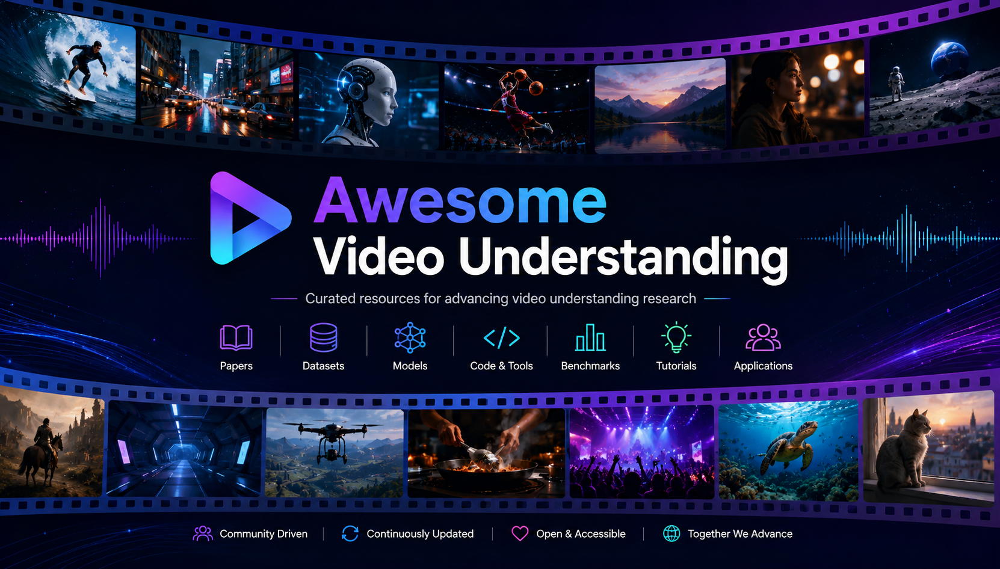

<div align="center">
  
  <br><br>
  <a href="https://awesome.re"></a>
  <a href="LICENSE"></a>
  <a href="CONTRIBUTING.md"></a>
  
  <br><br>
  <strong>A curated roadmap of models, methods, datasets, and benchmarks for video understanding with multimodal large language models.</strong>
  <br><br>
  <a href="#-start-here">Start here</a> ·
  <a href="#-video-llms">Models</a> ·
  <a href="#-training-resources">Training</a> ·
  <a href="#-evaluation">Evaluation</a> ·
  <a href="README_zh-CN.md">简体中文</a>
</div>

> This repository accompanies the survey **Video Understanding in the Era of Multimodal Large Language Models** by Yiming Zhong, Chang Nie, Yan Yang, Xiaoyu Liu, and Caifeng Shan. It favors representative, reproducible work over an exhaustive paper dump.

## ✨ Highlights

- **Architecture-first taxonomy** — navigate by frame encoding, multimodal alignment, and language backbone.
- **Task-aware resources** — datasets and benchmarks are separated by the capability they measure.
- **Curated, not collected** — every entry has a one-line reason for inclusion.
- **Community-maintained** — consistent entries, automated link checks, and a lightweight PR template.

## 🧭 Start here

| If you want to… | Recommended path | Good first reads |
|---|---|---|
| Understand the field | Milestones → architecture → evaluation | Video-LLaMA, VideoChat, LLaVA-Video |
| Process long videos | Long-context encoding | MovieChat, LLaMA-VID, LongVU, LongVILA |
| Build a live assistant | Streaming encoding | StreamingVLM, Flash-VStream, StreamChat |
| Train a model | Pre-training → instruction tuning → alignment | InternVideo, ShareGPT4Video, VideoChat-R1 |
| Evaluate a model | General → long-video → temporal → streaming | Video-MME, MLVU, TempCompass, StreamingBench |

<details>
<summary><strong>Legend and inclusion policy</strong></summary>

- 📄 paper · 💻 code · 🤗 model/data · 🌐 project page
- Entries must be directly relevant to video understanding with foundation models or Video-LLMs.
- Preference is given to released papers with code, data, checkpoints, or lasting conceptual value.
- Ordering within a section is approximately chronological; this is not a leaderboard.

</details>

## 📚 Contents

- [Survey](#-survey)
- [Latest papers](#-latest-papers)
- [Milestones](#-milestones)
- [Video-LLMs](#-video-llms)
  - [Basic encoding](#basic-encoding)
  - [Long-context encoding](#long-context-encoding)
  - [Streaming encoding](#streaming-encoding)
  - [Multimodal alignment](#multimodal-alignment)
- [Training resources](#-training-resources)
- [Evaluation](#-evaluation)
- [Challenges and frontiers](#-challenges-and-frontiers)
- [Contributing](#-contributing)

## 📝 Survey

### Video Understanding in the Era of Multimodal Large Language Models

**Yiming Zhong · Chang Nie · Yan Yang · Xiaoyu Liu · Caifeng Shan**

The survey organizes modern Video-LLMs through three architectural decisions—**frame encoding**, **multimodal alignment**, and **LLM selection**—then connects them to training strategies, datasets, evaluation protocols, and open challenges.

> 📌 The paper link and BibTeX will be added here when the publisher activates the public article page and DOI.

## 🔥 Latest papers

> Sorted by first public release, newest first. Star badges are live and update automatically from GitHub. A dash means that no official repository was available when the entry was added.

### 2026

| Date | Title | Topic | Paper / Code | Stars |
|:---:|---|---|:---:|:---:|
| 2026-06 | **Harnessing Streaming Video in the Wild** | Streaming system, proactive interaction, 12-hour memory | [📄](https://arxiv.org/abs/2606.08615) | — |
| 2026-05 | **Linear Scaling Video VLMs for Long Video Understanding** | Linear-time video encoding | [📄](https://arxiv.org/abs/2605.31598) | — |
| 2026-05 | **CRPO: Learning Spatiotemporal Sensitivity via Counterfactual RL** | Counterfactual reinforcement learning | [📄](https://arxiv.org/abs/2605.21988) | — |
| 2026-05 | **EvoVid: Temporal-Centric Self-Evolution for Video LLMs** | Temporal self-improvement | [📄](https://arxiv.org/abs/2605.21931) | — |
| 2026-05 | **VSTAT: Benchmarking Visual State Tracking in Multimodal Video Understanding** | Long-form state tracking | [💻](https://github.com/vision-x-nyu/vstat) | [](https://github.com/vision-x-nyu/vstat) |
| 2026-05 | **VideoOdyssey: Ultra-Long-Context and Omni-Modal Video Understanding** | Ultra-long visual and audio-visual evaluation | [📄](https://arxiv.org/abs/2605.22907) [💻](https://github.com/maifoundations/VideoOdyssey) | [](https://github.com/maifoundations/VideoOdyssey) |
| 2026-05 | **VideoZeroBench: Spatio-Temporal Evidence Verification** | Hierarchical evidence verification | [💻](https://github.com/marinero4972/VideoZeroBench) | [](https://github.com/marinero4972/VideoZeroBench) |
| 2026-03 | **FlexMem: Scaling Long Video Understanding via Visual Memory** | Training-free visual memory | [📄](https://arxiv.org/abs/2603.29252) [💻](https://github.com/city1517/FlexMem) | [](https://github.com/city1517/FlexMem) |
| 2026-03 | **RIVER: A Real-Time Interaction Benchmark for Video LLMs** | Streaming perception, memory, proactive response | [📄](https://arxiv.org/abs/2603.03985) [💻](https://github.com/OpenGVLab/RIVER) | [](https://github.com/OpenGVLab/RIVER) |
| 2026-01 | **Event-VStream: Event-Driven Real-Time Understanding for Long Video Streams** | Event-aware streaming and persistent memory | [📄](https://arxiv.org/abs/2601.15655) | — |

### 2025

| Date | Title | Topic | Paper / Code | Stars |
|:---:|---|---|:---:|:---:|
| 2025-12 | **MMSI-Video-Bench: Video-Based Spatial Intelligence** | Perception, planning, prediction, cross-video reasoning | [💻](https://github.com/InternRobotics/MMSI-Video-Bench) | [](https://github.com/InternRobotics/MMSI-Video-Bench) |
| 2025-10 | **EgoThinker: Egocentric Reasoning with Spatio-Temporal CoT** | Egocentric reasoning | [📄](https://arxiv.org/abs/2510.23569) | — |
| 2025-10 | **DSI-Bench: A Benchmark for Dynamic Spatial Intelligence** | Dynamic spatial reasoning | [📄](https://arxiv.org/abs/2510.18873) | — |
| 2025-10 | **FineVision: Open Data Is All You Need** | Open multimodal training data | [📄](https://arxiv.org/abs/2510.17269) | — |
| 2025-10 | **K-Frames: Scene-Driven Any-k Keyframe Selection** | Adaptive keyframe selection | [📄](https://arxiv.org/abs/2510.13891) | — |
| 2025-09 | **LLaVA-OneVision-1.5** | Fully open multimodal training framework | [📄](https://arxiv.org/abs/2509.23661) [💻](https://github.com/EvolvingLMMs-Lab/LLaVA-OneVision-1.5) | [](https://github.com/EvolvingLMMs-Lab/LLaVA-OneVision-1.5) |
| 2025-09 | **Kwai Keye-VL 1.5** | Video-native multimodal foundation model | [📄](https://arxiv.org/abs/2509.01563) | — |
| 2025-08 | **InternVL3.5** | Cascade RL and visual resolution routing | [📄](https://arxiv.org/abs/2508.18265) [💻](https://github.com/OpenGVLab/InternVL) | [](https://github.com/OpenGVLab/InternVL) |
| 2025-08 | **Thinking with Videos** | Tool-augmented RL for long-video reasoning | [📄](https://arxiv.org/abs/2508.04416) | — |
| 2025-06 | **Video-XL-2** | Task-aware KV sparsification for very long videos | [📄](https://arxiv.org/abs/2506.19225) | — |
| 2025-06 | **MiniMax-M1** | Efficient test-time scaling with lightning attention | [📄](https://arxiv.org/abs/2506.13585) | — |
| 2025-06 | **DeepVideo-R1** | Difficulty-aware regressive GRPO | [📄](https://arxiv.org/abs/2506.07464) | — |
| 2025-06 | **Reinforcement Learning Tuning for VideoLLMs** | Reward design and data efficiency | [📄](https://arxiv.org/abs/2506.01908) | — |
| 2025-06 | **Video-SALMONN 2: Captioning-Enhanced Audio-Visual LLMs** | Fine-grained audio-visual understanding | [📄](https://arxiv.org/abs/2506.15220) | — |
| 2025-05 | **CrossLMM: Dual Cross-Attention for Long Video Sequences** | Decoupled long-video alignment | [📄](https://arxiv.org/abs/2505.17020) | — |
| 2025-05 | **VideoEval-Pro** | Robust real-world long-video evaluation | [📄](https://arxiv.org/abs/2505.14640) | — |
| 2025-05 | **RTV-Bench** | Continuous real-time perception and reasoning | [📄](https://arxiv.org/abs/2505.02064) | — |
| 2025-05 | **Video-Holmes: Complex Video Reasoning** | Multi-clue causal reasoning | [💻](https://github.com/TencentARC/Video-Holmes) | [](https://github.com/TencentARC/Video-Holmes) |
| 2025-04 | **Video-MMLU** | Multi-discipline lecture understanding | [📄](https://arxiv.org/abs/2504.14693) | — |
| 2025-04 | **InternVL3: Exploring Advanced Training and Test-Time Recipes for Open-Source MLLMs** | General-purpose multimodal foundation model | [📄](https://arxiv.org/abs/2504.10479) [💻](https://github.com/OpenGVLab/InternVL) | [](https://github.com/OpenGVLab/InternVL) |
| 2025-04 | **VideoChat-R1: Enhancing Spatio-Temporal Perception via Reinforcement Fine-Tuning** | Reinforcement learning for video reasoning | [📄](https://arxiv.org/abs/2504.06958) [💻](https://github.com/OpenGVLab/VideoChat-R1) | [](https://github.com/OpenGVLab/VideoChat-R1) |
| 2025-04 | **VILAMP: Scaling Video-Language Models to 10K Frames** | Hierarchical differential distillation | [📄](https://arxiv.org/abs/2504.02438) | — |
| 2025-04 | **SpaceR: Reinforcing MLLMs in Video Spatial Reasoning** | Spatial reasoning with RL | [📄](https://arxiv.org/abs/2504.01805) | — |
| 2025-03 | **Exploring Hallucination in Video Understanding** | Benchmark, analysis, and mitigation | [📄](https://arxiv.org/abs/2503.19622) | — |
| 2025-03 | **FAVOR-Bench** | Fine-grained video motion understanding | [📄](https://arxiv.org/abs/2503.14935) | — |
| 2025-03 | **AdaReTAKE** | Adaptive redundancy reduction | [📄](https://arxiv.org/abs/2503.12559) | — |
| 2025-03 | **Agentic Keyframe Search for Video QA** | Agentic frame retrieval | [📄](https://arxiv.org/abs/2503.16032) | — |
| 2025-03 | **Video-R1: Reinforcing Video Reasoning in MLLMs** | Rule-based reinforcement learning | [📄](https://arxiv.org/abs/2503.21776) [💻](https://github.com/tulerfeng/Video-R1) | [](https://github.com/tulerfeng/Video-R1) |
| 2025-02 | **EgoNormia** | Physical and social norm understanding | [📄](https://arxiv.org/abs/2502.20490) | — |
| 2025-02 | **video-SALMONN-o1** | Reasoning-enhanced audio-visual LLM | [📄](https://arxiv.org/abs/2502.11775) | — |
| 2025-02 | **SVBench** | Temporal multi-turn streaming dialogue | [📄](https://arxiv.org/abs/2502.10810) | — |
| 2025-02 | **MM-RLHF** | Multimodal preference alignment | [📄](https://arxiv.org/abs/2502.10391) | — |
| 2025-02 | **Qwen2.5-VL** | Dynamic-resolution perception and long-video comprehension | [📄](https://arxiv.org/abs/2502.13923) [💻](https://github.com/QwenLM/Qwen2.5-VL) | [](https://github.com/QwenLM/Qwen2.5-VL) |
| 2025-01 | **VideoChat-Flash** | Hierarchical compression for long-context video modeling | [📄](https://arxiv.org/abs/2501.00574) | — |
| 2025-01 | **VideoLLaMA 3: Frontier Multimodal Foundation Models for Image and Video Understanding** | Vision-centric alignment and adaptive tokenization | [📄](https://arxiv.org/abs/2501.13106) [💻](https://github.com/DAMO-NLP-SG/VideoLLaMA3) | [](https://github.com/DAMO-NLP-SG/VideoLLaMA3) |
| 2025-01 | **Tarsier2: Advancing Large Vision-Language Models from Detailed Video Description to Comprehensive Video Understanding** | Dense description and general video understanding | [📄](https://arxiv.org/abs/2501.07888) [💻](https://github.com/bytedance/tarsier) | [](https://github.com/bytedance/tarsier) |
| 2025-01 | **Apollo: An Exploration of Video Understanding in Large Multimodal Models** | Data, architecture, and scaling study | [📄](https://arxiv.org/abs/2412.10360) [🌐](https://apollo-lmms.github.io/) | — |

### 2024

| Date | Title | Topic | Paper / Code | Stars |
|:---:|---|---|:---:|:---:|
| 2024-12 | **StreamChat: Chatting with Streaming Video** | Online video dialogue | [📄](https://arxiv.org/abs/2412.08646) | — |
| 2024-12 | **Inst-IT** | Explicit visual-prompt instruction tuning | [📄](https://arxiv.org/abs/2412.03565) | — |
| 2024-11 | **StreamingBench: Assessing the Gap for Streaming Video Understanding** | Streaming evaluation | [📄](https://arxiv.org/abs/2411.03628) [💻](https://github.com/THUNLP-MT/StreamingBench) | [](https://github.com/THUNLP-MT/StreamingBench) |
| 2024-11 | **Video-RAG** | Retrieval-augmented long-video comprehension | [📄](https://arxiv.org/abs/2411.13093) | — |
| 2024-11 | **Mixed Preference Optimization for MLLMs** | Multimodal preference optimization | [📄](https://arxiv.org/abs/2411.10442) | — |
| 2024-10 | **LongVU: Spatiotemporal Adaptive Compression for Long Video-Language Understanding** | Query-aware frame and token compression | [📄](https://arxiv.org/abs/2410.17434) [💻](https://github.com/Vision-CAIR/LongVU) | [](https://github.com/Vision-CAIR/LongVU) |
| 2024-10 | **TemporalBench** | Fine-grained temporal understanding | [📄](https://arxiv.org/abs/2410.10818) | — |
| 2024-10 | **LLaVA-Video: Video Instruction Tuning with Synthetic Data** | Large-scale synthetic instruction tuning | [📄](https://arxiv.org/abs/2410.02713) [💻](https://github.com/LLaVA-VL/LLaVA-NeXT) | [](https://github.com/LLaVA-VL/LLaVA-NeXT) |
| 2024-09 | **Q-Bench-Video: Video Quality Understanding of LMMs** | Perceptual video quality evaluation | [💻](https://github.com/Q-Future/Q-Bench-Video) | [](https://github.com/Q-Future/Q-Bench-Video) |
| 2024-08 | **LongVILA: Scaling Long-Context Visual Language Models for Long Videos** | Multimodal sequence parallelism | [📄](https://arxiv.org/abs/2408.10188) [💻](https://github.com/NVlabs/VILA) | [](https://github.com/NVlabs/VILA) |
| 2024-08 | **Kangaroo: A Powerful Long-Context Video-Language Model** | Long-context video input | [📄](https://arxiv.org/abs/2408.15542) | — |
| 2024-07 | **LongVideoBench: Long-Context Interleaved Video-Language Understanding** | Long-video benchmark | [📄](https://arxiv.org/abs/2407.15754) [💻](https://github.com/longvideobench/LongVideoBench) | [](https://github.com/longvideobench/LongVideoBench) |
| 2024-06 | **VideoLLaMA 2: Advancing Spatial-Temporal Modeling and Audio Understanding** | Audio-visual spatial-temporal modeling | [📄](https://arxiv.org/abs/2406.07476) [💻](https://github.com/DAMO-NLP-SG/VideoLLaMA2) | [](https://github.com/DAMO-NLP-SG/VideoLLaMA2) |
| 2024-06 | **Long Context Transfer from Language to Vision** | Cross-modal context transfer | [📄](https://arxiv.org/abs/2406.16852) | — |
| 2024-06 | **OmAgent** | Divide-and-conquer video agent | [📄](https://arxiv.org/abs/2406.16620) | — |
| 2024-06 | **VideoVista** | Versatile video understanding and reasoning benchmark | [📄](https://arxiv.org/abs/2406.11303) | — |
| 2024-06 | **VideoGPT+** | Joint image and video encoders | [📄](https://arxiv.org/abs/2406.09418) | — |
| 2024-06 | **MMWorld** | Multi-discipline world-model evaluation in videos | [📄](https://arxiv.org/abs/2406.08407) | — |
| 2024-06 | **LVBench** | Extreme long-video understanding | [📄](https://arxiv.org/abs/2406.08035) [💻](https://github.com/zai-org/LVBench) | [](https://github.com/zai-org/LVBench) |
| 2024-06 | **Flash-VStream: Memory-Based Real-Time Understanding for Long Video Streams** | Streaming visual memory | [📄](https://arxiv.org/abs/2406.08085) [💻](https://github.com/IVGSZ/Flash-VStream) | [](https://github.com/IVGSZ/Flash-VStream) |
| 2024-06 | **MLVU: Multi-Task Long Video Understanding** | Long-video evaluation | [📄](https://arxiv.org/abs/2406.04264) [💻](https://github.com/JUNJIE99/MLVU) | [](https://github.com/JUNJIE99/MLVU) |
| 2024-06 | **LongVA: Long Context Transfer from Language to Vision** | Text-to-vision context transfer | [📄](https://arxiv.org/abs/2406.16852) [💻](https://github.com/EvolvingLMMs-Lab/LongVA) | [](https://github.com/EvolvingLMMs-Lab/LongVA) |
| 2024-05 | **Video-MME: Comprehensive Evaluation of MLLMs in Video Analysis** | Duration- and modality-balanced evaluation | [📄](https://arxiv.org/abs/2405.21075) [💻](https://github.com/BradyFU/Video-MME) | [](https://github.com/BradyFU/Video-MME) |
| 2024-05 | **RLAIF-V** | Open-source AI feedback for trustworthy MLLMs | [📄](https://arxiv.org/abs/2405.17220) | — |
| 2024-05 | **CinePile** | Long-video question answering dataset | [📄](https://arxiv.org/abs/2405.08813) | — |
| 2024-04 | **PLLaVA: Parameter-Free LLaVA Extension for Video Dense Captioning** | Adaptive spatial pooling | [📄](https://arxiv.org/abs/2404.16994) [💻](https://github.com/magic-research/PLLaVA) | [](https://github.com/magic-research/PLLaVA) |
| 2024-04 | **MiniGPT4-Video** | Interleaved visual-textual tokens | [📄](https://arxiv.org/abs/2404.03413) | — |
| 2024-03 | **TempCompass: Do Video LLMs Really Understand Videos?** | Temporal perception diagnosis | [📄](https://arxiv.org/abs/2403.00476) [💻](https://github.com/llyx97/TempCompass) | [](https://github.com/llyx97/TempCompass) |
| 2024-02 | **ALLAVA** | GPT-4V-synthesized data for lightweight VLMs | [📄](https://arxiv.org/abs/2402.11684) | — |
| 2024-02 | **Momentor** | Fine-grained temporal reasoning | [📄](https://arxiv.org/abs/2402.11435) | — |
| 2024-02 | **RLAIF for Video MLLMs** | Reinforcement learning from AI feedback | [📄](https://arxiv.org/abs/2402.03746) | — |

### 2023

| Date | Title | Topic | Paper / Code | Stars |
|:---:|---|---|:---:|:---:|
| 2023-12 | **Silkie** | Preference distillation for visual language models | [📄](https://arxiv.org/abs/2312.10665) | — |
| 2023-12 | **TimeChat: A Time-Sensitive Multimodal Large Language Model for Long Video Understanding** | Timestamp-aware video dialogue | [📄](https://arxiv.org/abs/2312.02051) [💻](https://github.com/RenShuhuai-Andy/TimeChat) | [](https://github.com/RenShuhuai-Andy/TimeChat) |
| 2023-11 | **LLaMA-VID: An Image Is Worth 2 Tokens in Large Language Models** | Two-token frame representation | [📄](https://arxiv.org/abs/2311.17043) [💻](https://github.com/dvlab-research/LLaMA-VID) | [](https://github.com/dvlab-research/LLaMA-VID) |
| 2023-11 | **Video-Bench** | Video-LLM benchmark and toolkit | [📄](https://arxiv.org/abs/2311.16103) | — |
| 2023-11 | **GPT-4V for Visual Instruction Tuning** | Synthetic visual instruction generation | [📄](https://arxiv.org/abs/2311.07574) | — |
| 2023-11 | **Video-LLaVA: Learning United Visual Representation by Alignment Before Projection** | Unified image-video representation | [📄](https://arxiv.org/abs/2311.10122) [💻](https://github.com/PKU-YuanGroup/Video-LLaVA) | [](https://github.com/PKU-YuanGroup/Video-LLaVA) |
| 2023-10 | **UltraFeedback** | High-quality preference feedback | [📄](https://arxiv.org/abs/2310.01377) | — |
| 2023-09 | **Factually Augmented RLHF for MLLMs** | Factual alignment | [📄](https://arxiv.org/abs/2309.14525) | — |
| 2023-08 | **EgoSchema** | Very long-form video-language diagnosis | [📄](https://arxiv.org/abs/2308.09126) | — |
| 2023-07 | **MovieChat: From Dense Token to Sparse Memory for Long Video Understanding** | Long-video memory | [📄](https://arxiv.org/abs/2307.16449) [💻](https://github.com/rese1f/MovieChat) | [](https://github.com/rese1f/MovieChat) |
| 2023-07 | **InternVid** | Large-scale video-text pre-training data | [📄](https://arxiv.org/abs/2307.06942) [💻](https://github.com/OpenGVLab/InternVideo) | [](https://github.com/OpenGVLab/InternVideo) |
| 2023-06 | **Video-ChatGPT: Towards Detailed Video Understanding via Large Vision and Language Models** | Video dialogue and instruction data | [📄](https://arxiv.org/abs/2306.05424) [💻](https://github.com/mbzuai-oryx/Video-ChatGPT) | [](https://github.com/mbzuai-oryx/Video-ChatGPT) |
| 2023-06 | **Video-LLaMA: An Instruction-Tuned Audio-Visual Language Model** | Audio-visual instruction tuning | [📄](https://arxiv.org/abs/2306.02858) [💻](https://github.com/DAMO-NLP-SG/Video-LLaMA) | [](https://github.com/DAMO-NLP-SG/Video-LLaMA) |
| 2023-05 | **VideoChat: Chat-Centric Video Understanding** | Video-centric dialogue | [📄](https://arxiv.org/abs/2305.06355) [💻](https://github.com/OpenGVLab/Ask-Anything) | [](https://github.com/OpenGVLab/Ask-Anything) |
| 2023-03 | **EVA-CLIP** | Scaling vision-language pre-training | [📄](https://arxiv.org/abs/2303.15389) | — |
| 2023-02 | **Vid2Seq** | Dense video captioning with sequence prediction | [📄](https://arxiv.org/abs/2302.14115) | — |
| 2023-01 | **BLIP-2** | Query-based visual-language alignment | [📄](https://arxiv.org/abs/2301.12597) [💻](https://github.com/salesforce/LAVIS) | [](https://github.com/salesforce/LAVIS) |

### Foundations: 2019–2022

| Date | Title | Topic | Paper / Code | Stars |
|:---:|---|---|:---:|:---:|
| 2022-12 | **InternVideo: General Video Foundation Models** | Generative and discriminative video pre-training | [📄](https://arxiv.org/abs/2212.03191) [💻](https://github.com/OpenGVLab/InternVideo) | [](https://github.com/OpenGVLab/InternVideo) |
| 2022-04 | **Flamingo: A Visual Language Model for Few-Shot Learning** | Interleaved visual-language learning | [📄](https://arxiv.org/abs/2204.14198) | — |
| 2022-01 | **MERLOT Reserve** | Script knowledge from video and audio | [📄](https://arxiv.org/abs/2201.02639) | — |
| 2021-04 | **Frozen in Time** | End-to-end video-text representation learning | [📄](https://arxiv.org/abs/2104.00650) [💻](https://github.com/m-bain/frozen-in-time) | [](https://github.com/m-bain/frozen-in-time) |
| 2021-03 | **CLIP: Learning Transferable Visual Models from Natural Language Supervision** | Image-text contrastive pre-training | [📄](https://arxiv.org/abs/2103.00020) [💻](https://github.com/openai/CLIP) | [](https://github.com/openai/CLIP) |
| 2020-05 | **HERO: Hierarchical Encoder for Video+Language Omni-Representation** | Hierarchical video-language pre-training | [📄](https://arxiv.org/abs/2005.00200) | — |
| 2019-06 | **HowTo100M** | Large-scale narrated instructional video data | [📄](https://arxiv.org/abs/1906.03327) [🌐](https://www.di.ens.fr/willow/research/howto100m/) | — |
| 2019-04 | **VideoBERT** | Joint video-language representation learning | [📄](https://arxiv.org/abs/1904.01766) | — |

## 🕰️ Milestones

| Year | Work | Why it matters | Resources |
|:---:|---|---|:---:|
| 2025 | **Video-SALMONN 2** | Strengthens fine-grained audio-visual understanding using caption-enhanced training. | [📄](https://arxiv.org/abs/2506.15220) |
| 2024 | **LLaVA-Video** | Scales video instruction tuning with synthetic video data. | [📄](https://arxiv.org/abs/2410.02713) [💻](https://github.com/LLaVA-VL/LLaVA-NeXT) |
| 2023 | **LLaMA-VID** | Compresses each frame into two tokens for efficient long-video processing. | [📄](https://arxiv.org/abs/2311.17043) [💻](https://github.com/dvlab-research/LLaMA-VID) |
| 2023 | **Video-LLaMA** | Aligns visual and audio streams with an instruction-tuned language model. | [📄](https://arxiv.org/abs/2306.02858) [💻](https://github.com/DAMO-NLP-SG/Video-LLaMA) |
| 2023 | **VideoChat** | Introduces a chat-centric framework for video understanding. | [📄](https://arxiv.org/abs/2305.06355) [💻](https://github.com/OpenGVLab/Ask-Anything) |
| 2022 | **InternVideo** | Establishes a general video foundation model through generative and discriminative learning. | [📄](https://arxiv.org/abs/2212.03191) [💻](https://github.com/OpenGVLab/InternVideo) |

## 🎬 Video-LLMs

### Basic encoding

> Encode sampled frames independently with an image encoder, or model motion directly with a video-native encoder.

- **CLIP** — The standard image-text aligned visual backbone behind many early Video-LLMs. [📄](https://arxiv.org/abs/2103.00020) [💻](https://github.com/openai/CLIP)
- **SigLIP** — Replaces softmax contrastive learning with a sigmoid loss and scales efficiently. [📄](https://arxiv.org/abs/2303.15343) [💻](https://github.com/google-research/big_vision)
- **InternVideo** — A video-native encoder that explicitly models temporal dynamics. [📄](https://arxiv.org/abs/2212.03191) [💻](https://github.com/OpenGVLab/InternVideo)
- **InternVideo2** — Scales video foundation learning through masked token reconstruction and cross-modal contrastive objectives. [📄](https://arxiv.org/abs/2403.15377) [💻](https://github.com/OpenGVLab/InternVideo2)

### Long-context encoding

| Strategy | Representative work | Core idea | Resources |
|---|---|---|:---:|
| Token pooling | **PLLaVA** | Adaptive spatial pooling preserves temporal order while reducing visual tokens. | [📄](https://arxiv.org/abs/2404.16994) [💻](https://github.com/magic-research/PLLaVA) |
| Token abstraction | **LLaMA-VID** | Represents one frame with a context token and a content token. | [📄](https://arxiv.org/abs/2311.17043) [💻](https://github.com/dvlab-research/LLaMA-VID) |
| Memory | **MovieChat** | Uses short- and long-term memory to process videos beyond the context window. | [📄](https://arxiv.org/abs/2307.16449) [💻](https://github.com/rese1f/MovieChat) |
| Adaptive compression | **LongVU** | Removes redundant frames and preserves query-relevant detail at higher fidelity. | [📄](https://arxiv.org/abs/2410.17434) [💻](https://github.com/Vision-CAIR/LongVU) |
| Context transfer | **LongVA** | Transfers text-only long-context ability to video without long-video training. | [📄](https://arxiv.org/abs/2406.16852) [💻](https://github.com/EvolvingLMMs-Lab/LongVA) |
| Sequence parallelism | **LongVILA** | Extends VILA to thousands of frames through staged training and distributed systems. | [📄](https://arxiv.org/abs/2408.10188) [💻](https://github.com/NVlabs/VILA) |

### Streaming encoding

- **Flash-VStream** — Maintains a compact spatiotemporal memory for real-time video dialogue. [📄](https://arxiv.org/abs/2406.08085) [💻](https://github.com/IVGSZ/Flash-VStream)
- **StreamChat** — Updates visual context incrementally with a streaming cache. [📄](https://arxiv.org/abs/2409.14738)
- **StreamingVLM** — Preserves recent visual evidence while evicting redundant historical tokens. [📄](https://arxiv.org/abs/2503.10622)
- **VideoChat-Online** — Uses hierarchical memories and dynamic frame eviction for online dialogue. [📄](https://arxiv.org/search/?query=VideoChat-Online&searchtype=all)

### Multimodal alignment

| Family | Representative systems | Strength | Limitation |
|---|---|---|---|
| **Projection-based** | LLaVA-NeXT-Video, Qwen2-VL, InternVL | Simple, stable, parameter-efficient | Token count grows with frames |
| **Query-based** | BLIP-2, Video-LLaMA, VideoChat, TimeChat | Fixed or adaptive visual abstraction | May lose spatial and fine-grained detail |
| **Audio-visual** | video-SALMONN, Video-LLaMA 2 | Adds speech, music, and environmental cues | Fine-grained temporal alignment remains difficult |

Selected resources:

- **BLIP-2** — Introduces Q-Former, the canonical learnable-query alignment module. [📄](https://arxiv.org/abs/2301.12597) [💻](https://github.com/salesforce/LAVIS)
- **TimeChat** — Uses a sliding video Q-Former for timestamp-aware long-video understanding. [📄](https://arxiv.org/abs/2312.02051) [💻](https://github.com/RenShuhuai-Andy/TimeChat)
- **Qwen2-VL** — Provides dynamic-resolution visual tokenization and multimodal rotary position encoding. [📄](https://arxiv.org/abs/2409.12191) [💻](https://github.com/QwenLM/Qwen2-VL)

## 🧪 Training resources

### Pre-training datasets

| Dataset | Modality | Scale / focus | Resources |
|---|---|---|:---:|
| **WebVid-2M** | Video–text | Large-scale web video captions | [📄](https://arxiv.org/abs/2104.00650) [🤗](https://huggingface.co/datasets/TempoFunk/webvid-10M) |
| **HowTo100M** | Video–speech | Instructional videos with narrated text | [📄](https://arxiv.org/abs/1906.03327) [🌐](https://www.di.ens.fr/willow/research/howto100m/) |
| **InternVid** | Video–text | Large, diverse video-text pre-training corpus | [📄](https://arxiv.org/abs/2307.06942) [💻](https://github.com/OpenGVLab/InternVideo) |
| **Panda-70M** | Video–text | High-quality captions generated at web scale | [📄](https://arxiv.org/abs/2402.19479) [🌐](https://snap-research.github.io/Panda-70M/) |

### Instruction and preference data

- **VideoInstruct-100K** — Video instruction data introduced with VideoChatGPT. [📄](https://arxiv.org/abs/2306.05424) [💻](https://github.com/mbzuai-oryx/Video-ChatGPT)
- **ShareGPT4Video** — Detailed video captions and instruction data generated with an efficient captioner. [📄](https://arxiv.org/abs/2406.04325) [💻](https://github.com/ShareGPT4Omni/ShareGPT4Video)
- **LLaVA-Video-178K** — Synthetic instruction data covering open-ended video understanding tasks. [📄](https://arxiv.org/abs/2410.02713) [🤗](https://huggingface.co/datasets/lmms-lab/LLaVA-Video-178K)
- **VideoDPO** — Preference optimization data for reducing video-language hallucination and improving alignment. [📄](https://arxiv.org/search/?query=VideoDPO&searchtype=all)

### Training paradigms

- **Pre-training** — Learn general visual and temporal representations from large-scale paired data.
- **Instruction tuning** — Convert perception into conversational, question-answering, captioning, and grounding capabilities.
- **Preference alignment** — Use DPO, RLAIF, PPO, or GRPO to improve helpfulness, reasoning, and faithfulness.
- **Training-free systems** — Compose frozen encoders, captioners, retrievers, memories, and LLM agents at inference time.

## 📊 Evaluation

### General and long-video understanding

| Benchmark | Primary focus | Format | Resources |
|---|---|---|:---:|
| **MVBench** | 20 temporal and multimodal video tasks | Multiple choice | [📄](https://arxiv.org/abs/2311.17005) [💻](https://github.com/OpenGVLab/Ask-Anything) |
| **Video-MME** | Duration-, domain-, and modality-balanced evaluation | Multiple choice | [📄](https://arxiv.org/abs/2405.21075) [💻](https://github.com/BradyFU/Video-MME) |
| **MLVU** | Multi-task long-video understanding | Mixed | [📄](https://arxiv.org/abs/2406.04264) [💻](https://github.com/JUNJIE99/MLVU) |
| **LongVideoBench** | Interleaved video-language reasoning over long contexts | Multiple choice | [📄](https://arxiv.org/abs/2407.15754) [💻](https://github.com/longvideobench/LongVideoBench) |
| **LVBench** | Hour-long real-world video understanding | Multiple choice | [📄](https://arxiv.org/abs/2406.08035) [💻](https://github.com/zai-org/LVBench) |

### Temporal, streaming, and fine-grained evaluation

- **TempCompass** — Diagnoses temporal perception through counterfactual and caption-based tasks. [📄](https://arxiv.org/abs/2403.00476) [💻](https://github.com/llyx97/TempCompass)
- **StreamingBench** — Measures perception, memory, and reasoning over streaming video. [📄](https://arxiv.org/abs/2411.03628) [💻](https://github.com/THUNLP-MT/StreamingBench)
- **OVO-Bench** — Evaluates online video understanding under temporal constraints. [📄](https://arxiv.org/search/?query=OVO-Bench&searchtype=all)
- **MotionBench** — Tests whether models truly perceive motion rather than rely on static cues. [📄](https://arxiv.org/search/?query=MotionBench&searchtype=all)

## 🔭 Challenges and frontiers

```text
Video-LLMs
├── Perception       → fine detail, motion, audio, OCR, spatial grounding
├── Temporal memory  → long context, streaming, event boundaries
├── Reasoning        → causality, compositionality, multi-step inference
├── Reliability      → hallucination, calibration, evidence attribution
├── Efficiency       → token compression, adaptive compute, edge inference
└── Responsibility   → privacy, bias, safety, provenance
```

- **Faithful generation** — Ground every claim in visible or audible evidence and evaluate counterfactual robustness.
- **Adaptive computation** — Spend dense computation only on query-relevant moments without discarding brief events.
- **True audio-visual reasoning** — Align sounds to the frames and sources that produce them.
- **Interactive streaming** — Decide not only *what* to answer, but *when* to respond during an ongoing stream.
- **Better data** — Combine scalable model-generated annotations with targeted human verification.

## 🤝 Contributing

Contributions are welcome. Please read [CONTRIBUTING.md](CONTRIBUTING.md) before opening a pull request. A good addition includes a stable paper link, an official code or project link when available, and one sentence explaining why the work belongs in its category.

## 🙏 Acknowledgements

The presentation follows the curation principles of the [Awesome manifesto](https://github.com/sindresorhus/awesome/blob/main/awesome.md) and draws organizational inspiration from established multimodal research lists such as [Awesome Multimodal Large Language Models](https://github.com/BradyFU/Awesome-Multimodal-Large-Language-Models).

## 📜 License

To the extent possible under law, the maintainers have waived copyright and related rights to this curated list under [CC0 1.0](LICENSE). Individual papers, codebases, models, and datasets retain their original licenses.

<p align="right"><a href="#">Back to top ↑</a></p>
