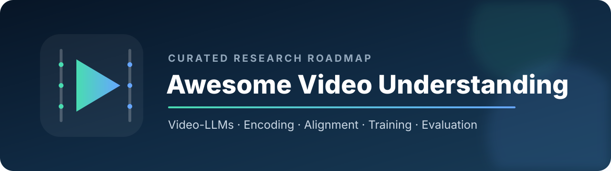

<div align="center">
  
  <h3>面向多模态大语言模型的视频理解资源导航</h3>
  <p><a href="README.md">English</a> · <a href="#快速导航">快速导航</a> · <a href="CONTRIBUTING.md">参与贡献</a></p>
</div>

本仓库配套综述论文 **Video Understanding in the Era of Multimodal Large Language Models**，按照论文的技术体系整理代表性 Video-LLM、训练数据、评测基准与未来方向。完整条目及论文、代码链接请查看[英文主页](README.md)。

## 仓库特色

- **以架构为主线**：帧编码、多模态对齐、语言模型选择。
- **以能力为索引**：长视频、流式理解、音视频融合、时序推理与可靠性。
- **精选而非堆砌**：每个条目均说明其代表性，不追求无差别收录。
- **适合持续维护**：统一条目格式，并配置贡献模板与链接检查。

## 快速导航

| 研究目标 | 建议阅读路线 | 代表工作 |
|---|---|---|
| 入门 Video-LLM | 里程碑 → 编码 → 对齐 → 评测 | Video-LLaMA、VideoChat、LLaVA-Video |
| 长视频理解 | Token 压缩 → 关键帧 → 上下文扩展 | LLaMA-VID、LongVU、LongVILA |
| 流式视频理解 | 增量编码 → 动态记忆 → 主动响应 | Flash-VStream、StreamingVLM |
| 模型训练 | 预训练 → 指令微调 → 偏好对齐 | InternVideo、ShareGPT4Video |
| 系统评测 | 综合 → 长视频 → 时序 → 流式 | Video-MME、MLVU、TempCompass、StreamingBench |

## 技术框架

```text
Video-LLM
├── 帧编码
│   ├── 基础编码：图像编码器 / 视频原生编码器
│   ├── 长上下文：Token 压缩 / 关键帧 / 上下文扩展
│   └── 流式编码：增量处理 / 动态记忆
├── 多模态对齐
│   ├── Projection-based
│   └── Query-based
├── 训练策略
│   ├── 预训练 / 指令微调 / 偏好对齐
│   └── Training-free
└── 评测
    ├── 综合与长视频
    └── 时序、流式与细粒度理解
```

## 论文信息

**题目：** Video Understanding in the Era of Multimodal Large Language Models<br>
**作者：** Yiming Zhong、Chang Nie、Yan Yang、Xiaoyu Liu、Caifeng Shan

论文 DOI 和正式页面公开后，将在仓库首页补充论文链接与 BibTeX。

## 参与贡献

欢迎通过 Issue 或 Pull Request 推荐高质量工作。新增条目需提供论文链接、官方代码或项目链接（如有），并用一句话说明该工作的代表性。具体要求见 [CONTRIBUTING.md](CONTRIBUTING.md)。

## 许可协议

本资源列表采用 [CC0 1.0](LICENSE)。收录的论文、代码、模型和数据集仍遵循各自的原始许可协议。
